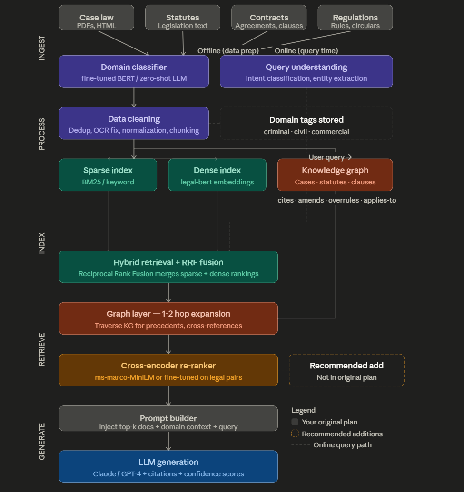

# legal-advisory-system-graphRAG

graphrag-pipeline/
│── app/
│   │── main.py
│
│   │── config/
│   │   ├── settings.py
│
│   │── ingestion/
│   │   ├── loader.py
│   │   ├── cleaner.py
│
│   │── processing/
│   │   ├── chunker.py
│   │   ├── embeddings.py
│
│   │── vector_store/
│   │   ├── faiss_store.py
│
│   │── graph_store/
│   │   ├── neo4j_store.py
│
│   │── retriever/
│   │   ├── rag_retriever.py
│
│   │── models/
│   │   ├── schemas.py
│
│── data/
│── tests/
│── requirements.txt
│── .env
│── .gitignore
│── README.md

